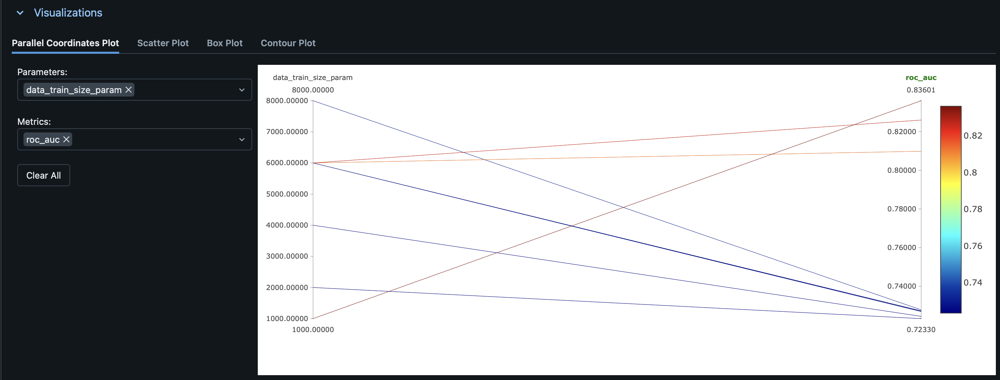
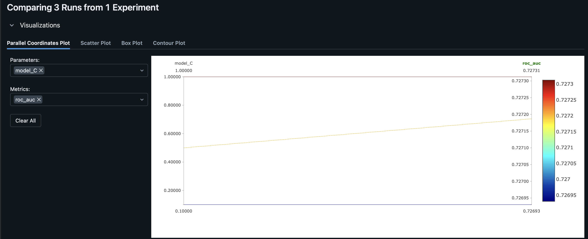
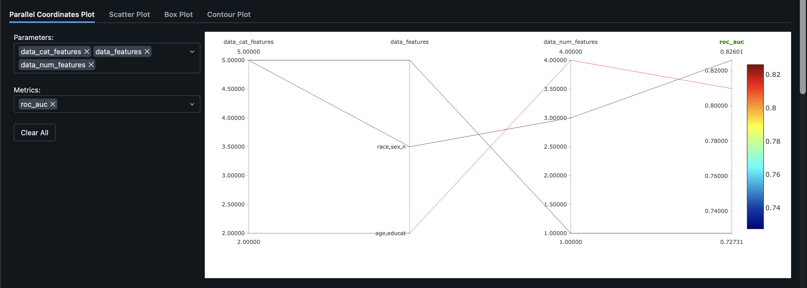

# Отчёт по результатам экспериментов MLflow

**Эксперимент:** homework_Bazhenov  
**Ссылка на лучший запуск (ROC-AUC):** [http://158.160.2.37:5000/#/experiments/38/runs/def3edb642584145b194f1d25882fa00](http://158.160.2.37:5000/#/experiments/38/runs/def3edb642584145b194f1d25882fa00)

---

## Разрез 1: Размер тренировочного датасета

### Описание

- **Гипотеза:** увеличение размера тренировочного датасета улучшает качество модели (метрику ROC-AUC).
- **Параметр:** `data_train_size_param` — размер тренировочного датасета.
- **Изменение:** по сетке от 2000 до 8000 с шагом 2000 (частично до 10000 в зависимости от доступных данных).

### Графики и таблицы

**Таблица сравнения запусков (при фиксированном наборе признаков):**

| Запуск              | data_train_size_param | roc_auc  | model_C |
|---------------------|------------------------|----------|---------|
| nebulous-sponge-147 | 2000                   | 0.7961   | 1.0     |
| wistful-dolphin-16  | 4000                   | 0.7980   | 1.0     |
| whimsical-hen-398   | 6000                   | 0.7273   | 1.0     |
| bald-gnu-564        | 8000                   | 0.7278   | 1.0     |

### Выводы

Гипотеза **не подтверждается** в чистом виде. При фиксированном наборе признаков (`race, sex, native.country, occupation, education, capital.gain`) наблюдается:

- Рост ROC-AUC при увеличении размера датасета с 2000 до 4000 (0.796 → 0.798).
- Снижение метрики при дальнейшем увеличении до 6000 и 8000 (≈0.727).

Рост до 4000 может указывать на полезность дополнительных данных, а последующее снижение — на переобучение или влияние других факторов. Максимальные значения ROC-AUC (≈0.81–0.83) достигаются при другом наборе признаков и train_size=6000, что говорит о важности выбора признаков, а не только размера датасета.

---

## Разрез 2: Параметр регуляризации (model_C)

### Описание

- **Гипотеза:** изменение силы регуляризации (параметр C) влияет на ROC-AUC; при увеличении C модель меньше регуляризуется и может дать лучший результат.
- **Параметр:** `model_C` — обратная сила регуляризации (меньше C → сильнее регуляризация).
- **Изменение:** по сетке 0.1, 0.5, 1.0.

### Графики и таблицы

| Запуск              | model_C | roc_auc  | precision | recall |
|---------------------|---------|----------|-----------|--------|
| dashing-dove-120    | 0.1     | 0.7269   | 0.807     | 0.207  |
| invincible-moth-665 | 0.5     | 0.7272   | 0.805     | 0.206  |
| whimsical-hen-398   | 1.0     | 0.7273   | 0.805     | 0.207  |

### Выводы

Гипотеза **частично подтверждается**, но эффект слабый. ROC-AUC практически не меняется при увеличении C с 0.1 до 1.0 (0.7269 → 0.7273). Для данного набора признаков и размера датасета сила регуляризации почти не влияет на ROC-AUC. Более сильное влияние на метрику оказывает выбор признаков.

---

## Разрез 3: Набор признаков (data_features)

### Описание

- **Гипотеза:** использование более информативных признаков (например, возраст, образование, часы работы, семейный статус) повышает ROC-AUC.
- **Параметр:** `data_features` — список признаков для обучения.
- **Изменение:** три варианта:
  1. `race, sex, native.country, occupation, education, capital.gain` (5 категориальных, 1 числовой)
  2. `age, education, hours.per.week, capital.gain, capital.loss, sex` (4 числовых, 2 категориальных)
  3. `age, education.num, hours.per.week, marital.status, occupation, relationship, sex, native.country` (3 числовых, 5 категориальных)

### Графики и таблицы

**Таблица сравнения запусков (train_size=6000):**

| Запуск              | data_features (сокращённо)                                      | data_num | data_cat | roc_auc  |
|---------------------|------------------------------------------------------------------|----------|----------|----------|
| whimsical-hen-398   | race, sex, native.country, occupation, education, capital.gain   | 1        | 5        | 0.7273   |
| omniscient-loon-144 | age, education, hours.per.week, capital.gain, capital.loss, sex   | 4        | 2        | 0.8099   |
| bald-vole-644       | age, education.num, hours.per.week, marital.status, occupation... | 3        | 5        | **0.8260** |

### Выводы

Гипотеза **подтверждается**. Выбор признаков сильно влияет на ROC-AUC:

- Базовый набор (race, sex, native.country, occupation, education, capital.gain) даёт ROC-AUC ≈ 0.727.
- Добавление возрастных и экономических признаков (age, hours.per.week, capital.gain, capital.loss) повышает ROC-AUC до ≈ 0.810.
- Наилучший результат (ROC-AUC ≈ 0.826) достигается при использовании возраста, образования, часов работы, семейного статуса, занятости, типа отношений, пола и страны происхождения.

Наиболее информативными для задачи оказались признаки: `age`, `education.num`, `hours.per.week`, `marital.status`, `occupation`, `relationship`, `sex`, `native.country`.

---

## Итоговые выводы

1. **Размер датасета:** при фиксированных признаках увеличение размера датасета с 2000 до 4000 немного улучшает ROC-AUC; при 6000–8000 метрика падает, что может быть связано с переобучением или неоптимальными признаками.
2. **Регуляризация (C):** в диапазоне 0.1–1.0 почти не влияет на ROC-AUC для рассмотренных конфигураций.
3. **Набор признаков:** основной фактор качества. Переход к более содержательным признакам (возраст, образование, часы работы, семейный статус и др.) даёт прирост ROC-AUC с ~0.727 до ~0.826.

**Лучший запуск по ROC-AUC:** [bald-vole-644](http://158.160.2.37:5000/#/experiments/38/runs/def3edb642584145b194f1d25882fa00) — ROC-AUC ≈ 0.826, признаки: age, education.num, hours.per.week, marital.status, occupation, relationship, sex, native.country.
