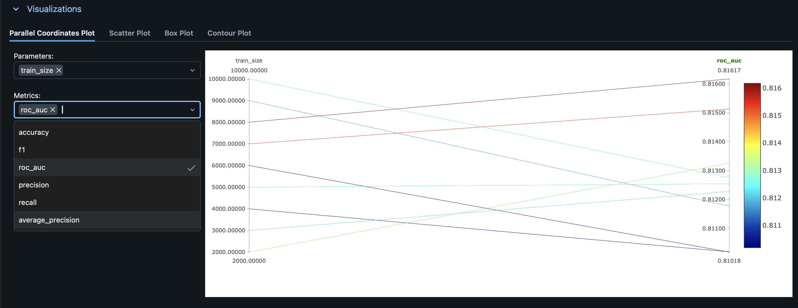
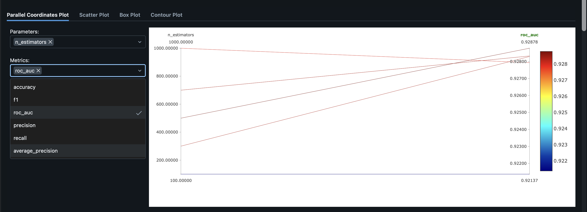
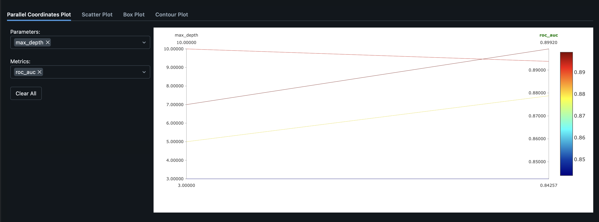

# Отчёт по экспериментам коллеги: homework_ulyanova

## Общая информация

- Анализируются эксперименты коллеги **homework_ulyanova**.
- Судя по параметрам `n_estimators` и `max_depth`, используется ансамблевый метод (например, RandomForest/GradientBoosting).
- Основная метрика для сравнения — **ROC-AUC**.

---

## Разрез 1: Размер тренировочного датасета (train_size)

### Описание

- **Гипотеза:** увеличение размера тренировочного датасета улучшает качество модели (ROC-AUC), но после некоторого порога эффект насыщается.
- **Параметр:** `train_size`.
- **Изменение:** примерно от **2000** до **10000** (по графику `train_size_ul.png`).

### Графики и таблицы

### Выводы

- При малых значениях `train_size` (около 2000) ROC-AUC находится на уровне ~0.810–0.812.
- При увеличении до 6000–8000 метрика растёт до ~0.813–0.815.
- Наибольшее значение ROC-AUC (~0.816–0.817) достигается при `train_size ≈ 10000`.

**Итог:** гипотеза подтверждается: чем больше обучающих данных, тем выше ROC-AUC, но прирост становится небольшим при переходе от 8000 к 10000 объектам.

---

## Разрез 2: Число деревьев (n_estimators)

### Описание

- **Гипотеза:** увеличение числа деревьев в ансамбле (параметр `n_estimators`) повышает ROC-AUC до определённого уровня, после чего прирост замедляется.
- **Параметр:** `n_estimators`.
- **Изменение:** от **100** до **1000** (по графику `n_est_ul.png`).

### Графики и таблицы

### Выводы

- При `n_estimators ≈ 100` ROC-AUC ~0.921–0.922.
- При `n_estimators ≈ 400–600` метрика растёт до ~0.925–0.927.
- Максимальное значение ROC-AUC (~0.928–0.929) достигается при `n_estimators = 1000`.

**Итог:** гипотеза подтверждается. Большее число деревьев улучшает качество, но после 400–600 деревьев прирост становится небольшим, поэтому важно учитывать баланс между качеством и затратами ресурсов.

---

## Разрез 3: Максимальная глубина деревьев (max_depth)

### Описание

- **Гипотеза:** увеличение максимальной глубины деревьев позволяет модели лучше подстраиваться под данные и повышает ROC-AUC, но слишком большая глубина может привести к переобучению.
- **Параметр:** `max_depth`.
- **Изменение:** примерно от **3** до **10** (по графику `max_dep_ul.png`).

### Графики и таблицы

### Выводы

- При `max_depth ≈ 3–5` ROC-AUC находится на уровне ~0.84–0.87.
- При увеличении глубины до 7–9 метрика растёт до ~0.88–0.89.
- Лучшее значение ROC-AUC (~0.899) наблюдается при `max_depth ≈ 10`.

**Итог:** в рассматриваемом диапазоне 3–10 увеличение глубины стабильно улучшает ROC-AUC, признаков сильного переобучения по графику не видно.

---

## Итоговые выводы по экспериментам Ulyanova

1. **Размер обучающей выборки (train_size):** больше данных даёт более высокую ROC-AUC; максимум достигается при `train_size` около полного датасета (≈10000).
2. **Число деревьев (n_estimators):** рост от 100 до 1000 повышает ROC-AUC с ≈0.921 до ≈0.928–0.929; после 400–600 деревьев отдача снижается.
3. **Максимальная глубина (max_depth):** увеличение глубины с 3 до 10 улучшает ROC-AUC с ~0.84 до ~0.899; лучшая глубина в экспериментах — около 10.

> Суммарно, лучшие результаты у коллеги достигаются при больших значениях `train_size`, `n_estimators` и `max_depth` (полные данные, много деревьев, достаточно глубокие деревья). Эти настройки можно рассматривать как эталонную конфигурацию в его экспериментах.
